# Project Name

Capstone 1

# Online Version

https://gealsanchez.github.io/CapstoneProject1/

## Screenshots

<h3 align="center">Screenshot</h3>

  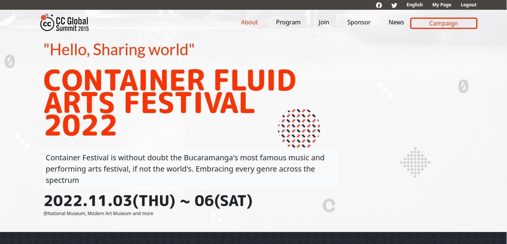

  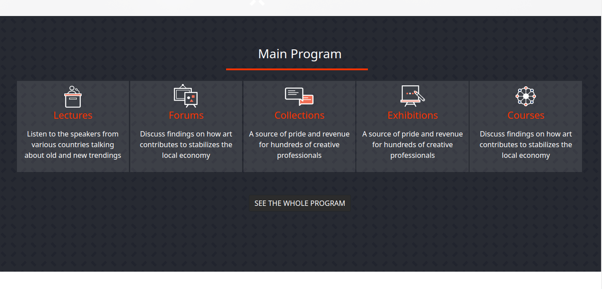

  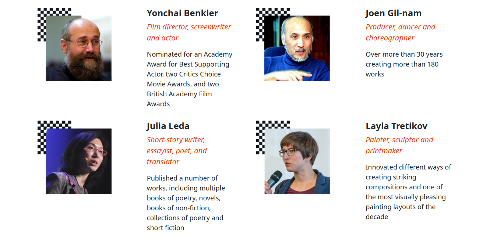

  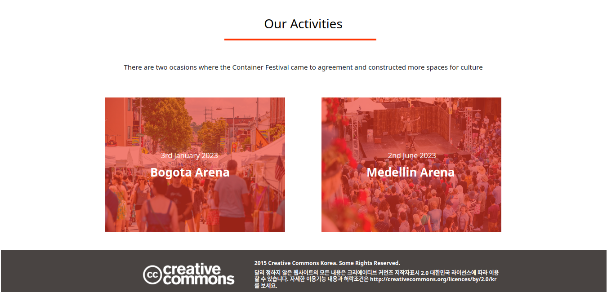

  

  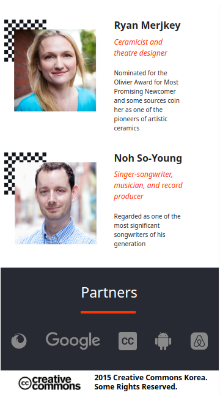

  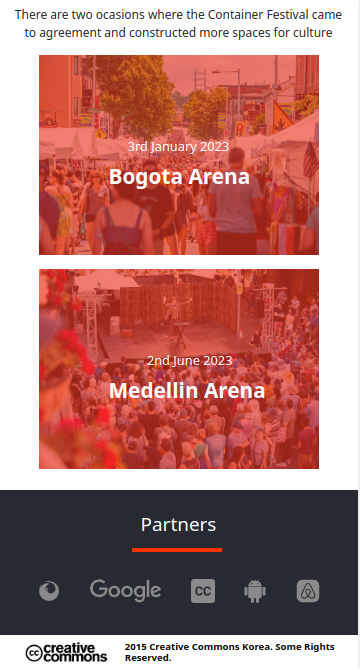

  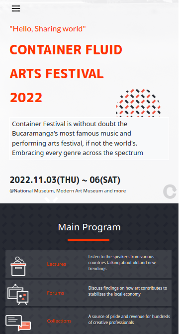

  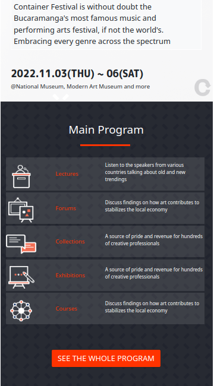

  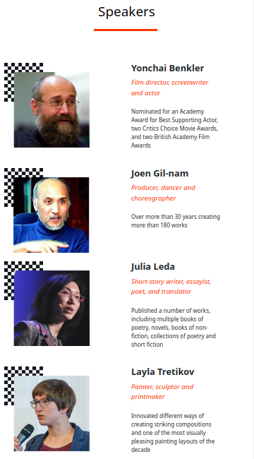

  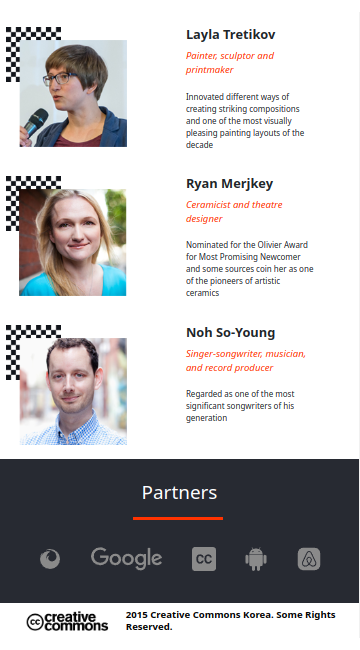

  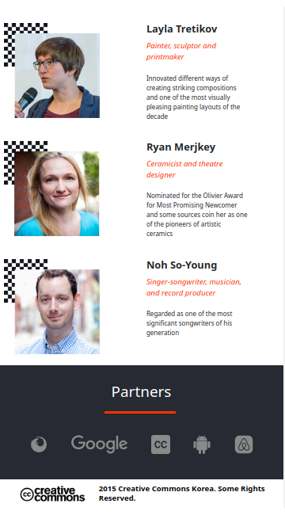

# Presentation video

[https://www.loom.com/share/6d2ea78c99f547a3a1c7d2bedcb6c66c]

## Built With

- HTML & CSS & Javascript
- GitHub

## Authors

👤 **Author1**

- GitHub: [@githubhandle](https://github.com/gealsanchez)
- Twitter: [@twitterhandle](https://twitter.com/gealsanchez)
- LinkedIn: [LinkedIn](https://www.linkedin.com/in/gerson-sanchez-88309b57/)

## 🤝 Contributing

Contributions, issues, and feature requests are welcome!

## Show your support

Give a ⭐️ if you like this project!

## Acknowledgments

- Wali Muhammad
- Cindy Shin

## 📝 License

This project is [MIT](./MIT.md) licensed.

_NOTE: we recommend using the [MIT license](https://github.com/gealsanchez/portfolio/blob/htmlCSS-Session-Day-3/LICENSE) - you can set it up quickly by [using templates available on GitHub](https://docs.github.com/en/communities/setting-up-your-project-for-healthy-contributions/adding-a-license-to-a-repository). You can also use [any other license](https://choosealicense.com/licenses/) if you wish._
